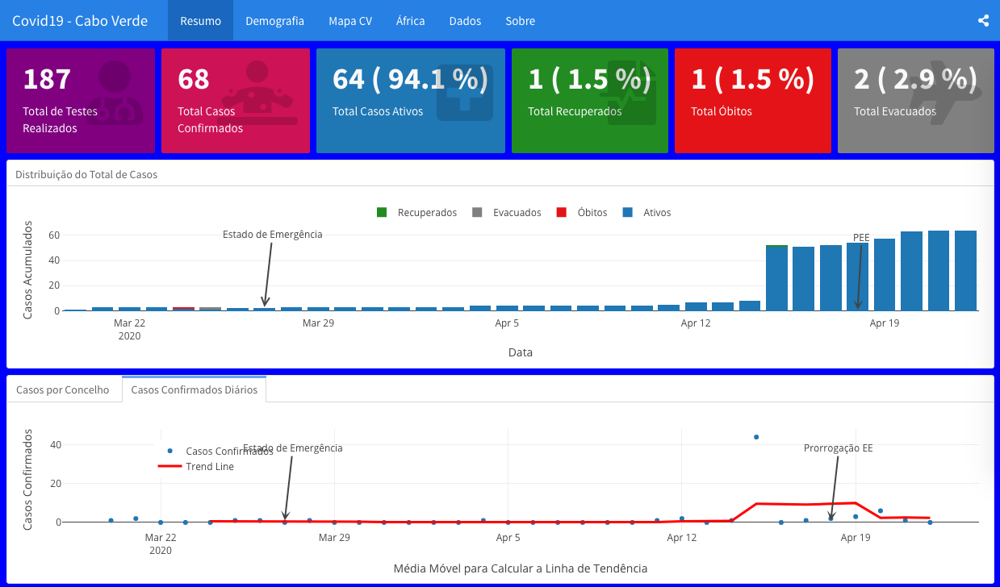

# Covid19 Cabo Verde Dashboard

<!-- badges: start -->

<!-- badges: end -->

This [Covid19 Cabo Verde dashboard](https://marovski.github.io/covid19cvdashboard) provides an overview of the 2019 Novel Coronavirus COVID-19 (2019-nCoV) epidemic in Cabo Verde. This dashboard is built with R using the [R Markdown](https://rmarkdown.rstudio.com/) framework and can easily reproduce by others.

### Visualizations
This dashboards contains several types of charts, all built with [Plotly](https://plotly.com/r/).

---------------------

--------------------

### Packages

* [Flexdashboard](https://rmarkdown.rstudio.com/flexdashboard/) to visualize data on Covid19 in Cabo Verde;
* [Mapview](https://r-spatial.github.io/mapview/) for the spatial map;
* [DT](https://rstudio.github.io/DT/) package for data table;
* [Plotly](https://plotly.com/r/) for the charts;
* [Dplyr and tidyr](https://dplyr.tidyverse.org/) for data wrangling.

### Data
The provided data are from [covid19cvdata](https://github.com/marovski/covid19cvdata) and [coronavirus](https://github.com/RamiKrispin/coronavirus) package.

### Data Source

* The raw data in [covid19cvdata](https://github.com/marovski/covid19cvdata) package was obtained from public website [covid19.cv](www.covid19.cv).

* The raw data from [coronavirus](https://github.com/RamiKrispin/coronavirus) from Johns Hopkins University Center for Systems Science and Engineering (JHU CCSE).

### Credits

+ covid19-dash by [João Silva](https://rpubs.com/joaosilva/covid19-dash): Thanks to João work and [post](https://www.linkedin.com/posts/antonio-joao_rpubs-covid-19-dashboard-activity-6647282965627850752-LvFd) I've came in contact with flexdashboard and how to build interesting dashboard. This inspired me to build something focus in Cabo Verde and Africa.

* [Coronavirus Dashboard](https://ramikrispin.github.io/coronavirus_dashboard/#summary) by Rami Krispin: The awesome work and code done by Rami served as a inpiration and base for this project. It is a bible to learn how are build dashboards and follow the tidy standart format applied by his project Covid19R. Thank You!

-------------------
Please note that the 'covid19-caboverde-dashboard' project is released with a [Contributor Code of Conduct](.github/CODE_OF_CONDUCT.md). By contributing to this project, you agree to abide by its terms.
